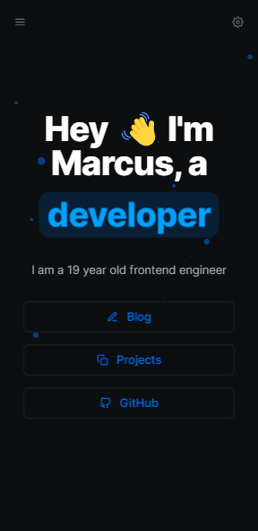

<h1 align="center">My portfolio 📓</h1>

<p align="center">🔥 Meu site profissional para compartilhar ao mundo!</p>

<p align="center">
 <a href="#-executar">Como executar</a> •
 <a href="#-tecnologias">Tecnologias</a> •
 <a href="#-projeto">Projeto</a> • 
 <a href="#-objetivo">Objetivo</a> • 
  <a href="#-roadmap">Roadmap</a>
</p>

<br />

## 💻 Version Web

<br />

<div id="layout" align="center">
  <p align="stretch">
    
    
  </p>
</div>

<br />

## 🚀 Como executar

Clone o repositório e acesse a pasta.

```bash
$ git clone https://github.com/maarcusvinicius/marcus.dev.git

Para iniciar o projeto:

# Instalar as dependências
$ npm install / yarn

# Iniciar o projeto
$ npm run / yarn run
```

A aplicação pode ser acessada em [`localhost:#`](localhost:#)

<br />

## 🔧 Tecnologias

Esse projeto foi desenvolvido com as seguintes tecnologias:

-   [React](https://reactjs.org/)
-   [Next.js](https://nextjs.org/)
-   [TypeScript](https://www.typescriptlang.org/)
-   [Tailwindcss](https://tailwindcss.com/)
-   [Yarn](https://yarnpkg.com/)

<br />

## 💻 Projeto

Meu porffólio é um projeto que mostra tudo que sei via Web, tem blogs falando sobre minha vida até este momento, é possível ver como melhorei diante minha carreiraa, sendo hoje meu maior forte, Front End com React. Acredito que até o fim de 2023 venho falar mais!

<br />

## ✅ Objetivo

Mostrar minha história, acredito que tenha sido meu melhor projeto, feito com carinho cada parte escrita e claro, me aprofundar mais em Clean Code, Next.js, TypeScript e utilização de Tailwindcss para estilização dos futuros projetos, acessível e de fácil compreensão!!

<br />

## 🏍️ Roadmap

<br />

    - [x] Criar version Web

    - [x] Criar version Mobile

    - [x] Personalizar Tailwind CSS

    - [x] Link para projetos com CMS

    - [x] Teminar Blogs

    - [x] Deploy Vercel

<br />

<h4 align="center"> 
	🚧  My portfolio 📓 FINALIZADO  🚧
</h4>
<br />

<br />

Feito com ❤️ por Marcus Vinicius 👋🏽 Entre em contato!

//feito readme marcus

### Olá, sou Marcus 

Sou Desenvolvedor Web, um programador procurando fazer a diferença no mundo digital. [**Profile Github**](https://github.com/maarcusvinicius). 🚀

#### Minhas ferramentas atuais

📲 Front-end Mobile com React Native  
🌎 Front-end Web com Reactjs  
📡 Back-end com Nodejs  
🛠️ Typescript  
🧰 And more...

#### 💬 Encontre-me em outro lugar

[](https://www.linkedin.com/in/marcus-vinicius-507718228/)
[](marcus.editor77@gmail.com)
