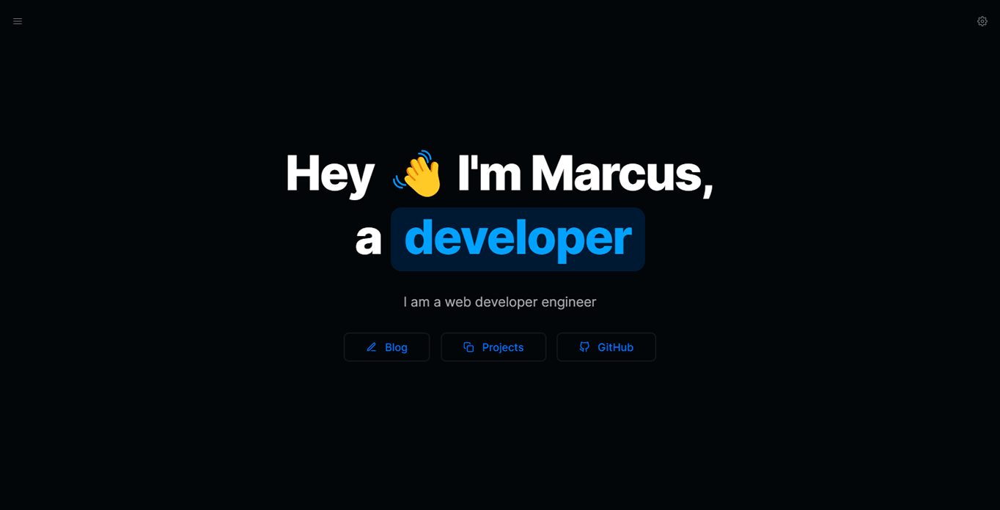
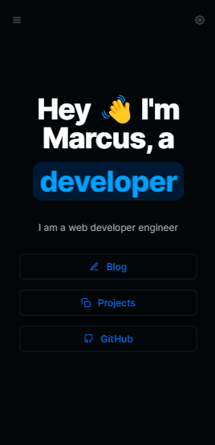

<h1 align="center">My portfolio 📓</h1>

<p align="left">🔥A professional website to share my story and skills as a developer!

<br />

The application consists of sharing my skills and competences with the world. The site features a set of blogs that talk about my professional history and evolution to date, including my skills with React, which is my specialty. The project was developed with technologies such as React, Next.js, TypeScript, Tailwindcss and Yarn.

</p>

<br />

## 💻 Version 2.0

<br />

<div id="layout" align="center">
  <p align="stretch">
    
    
  </p>
</div>

<br />

Teste você mesmo!!🔎 https://marcus-dev.vercel.app/

<br />

## 🎡 Functionalities

-   Display information about the author of the site, including name, photo, education and professional experience

-   View portfolio of projects developed by the author, with detailed information about each one of them

-   Display blog with articles and content created by the author, organized by themes or categories

-   Display contact so visitors can send messages and communicate with website author

-   Offer a responsive version of the website to improve the user experience on different devices

-   Use animations and visual effects to improve the user experience and make the site more attractive

<br />

## 🔧 Resources used

This project was developed with the following resources and technologies:

-   [Next 13](https://nextjs.org/)
-   [React](https://reactjs.org/)
-   [React Router](https://reactrouter.com/en/main)
-   [React Dom](https://legacy.reactjs.org/docs/react-dom.html)
-   [TypeScript](https://www.typescriptlang.org/)
-   [JSON](https://developer.mozilla.org/pt-BR/docs/Learn/JavaScript/Objects/JSON)
-   [Yarn](https://yarnpkg.com/)
-   [Tailwindcss](https://tailwindcss.com/)

<br />

## 🚀 How to run the project

1. Clone the repository to your local machine.

```bash
$ git clone https://github.com/maarcusvinicius/marcus.dev.git
```

2. Navigate to the project directory and install dependencies.

```bash
$ cd marcus.dev
$ npm install
```

3. Start the development server.

```bash
$ npm start
```

4. Open your browser and go to http://localhost:3000 to view the application.

<br />

## 💻 Project structure

```bash
marcus.dev/
  .next/
  components/
    Background/
    Blog/
    Button/
    List/
    Navbar/
    Pill/
    Animate.component.tsx
    index.ts
  data/
  layouts/
  lib/
  node_modules/
  pages/
  public/
  types/
  .eslintrc.json
  .gitignore
  .prettierignore
  .yarnrc.yml
  README.md
  next-env.d.ts
  next-sitemap.js
  next.config.js
  package.json
  tailwind.config.js
  tsconfig.json
  windi.config.ts
  yarn.lock
```

<br />

## 🏍️ Components

<br />

-   `Background`: is a component that renders a background with a background image.

-   `Blog`: is a component that displays a list of blog posts, allowing navigation between pages.

-   `Button`: is a component that displays a customizable button.

-   `List`: is a component that displays a list of items.

-   `Navbar`: is a component that renders a navigation bar.

-   `Pill`: is a component that displays an item in the form of a "pill", used to show tags or categories.

-   `Animate.component.tsx`: is a component responsible for applying animations to page elements.

-   `index.ts`: it is the main file of the folder, which exports all available components to be used in the project.

<br />

## License

<p>

This project is licensed under the [MIT License](https://opensource.org/license/mit/). Feel free to use, modify and distribute it as needed.

</p>

<br />
<br />
<br />
<h4 align="center"> 
	🚧  My portfolio 📓 FINISHED  🚧
</h4>
<br />
<br />
<br />
<br />
<br />

Made with ❤️ by Marcus Vinicius 👋🏽 Get in touch!

//done readme marcus

### 𝐇𝐞𝐥𝐥𝐨 𝐭𝐡𝐞𝐫𝐞, 𝐟𝐞𝐥𝐥𝐨𝐰 <𝚌𝚘𝚍𝚎𝚛𝚜/>! 

I'm a Web Developer, a programmer looking to make <br /> a difference in the digital world. [**Personal Site**](https://marcus-dev.vercel.app/) 🚀

#### My current tools

📲 Front-end Mobile with React Native  
💻 Front-end Web with Reactjs  
📡 Back-end with Nodejs  
🔣 Typescript  
🧰 And more...

#### 💬 Find me elsewhere

[](https://www.linkedin.com/in/marcus-vinicius-507718228/)
[](marcus.editor77@gmail.com)
